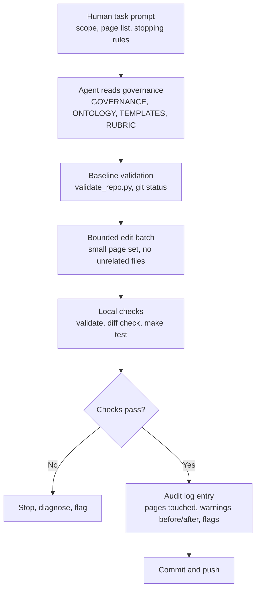

# TransparentGov Agent Workflow

> A TransparentGov platform pattern, illustrated by the Nepal Energy Wiki — the first content vertical.

## Context

This repository uses AI agents for research cleanup, wiki maintenance, documentation, and validation. The main risk is not syntax errors. It is epistemic drift: agents can add confident prose, inconsistent terminology, inflated backlinks, or unsourced quantitative claims unless the repo gives them explicit constraints and automated checks.

## Constraints

- Agents enter with partial context and can overgeneralize from earlier pages.
- Wiki pages have different authority levels; the same sentence may be valid in a synthesis page and invalid in a data page.
- Quantitative claims need source linkage.
- Source `Used By` sections must reflect exact backlinks, not semantic similarity.
- Bulk editing can create consistent-looking but unsupported prose.
- Human review time is limited, so failures must be easy to locate.

## Architecture

The workflow treats the repository as the control surface. The prompt gives the agent the task, but the repo supplies the rules, tests, and audit trail.

## Tradeoffs

- Strict templates slow down freeform writing, but make pages comparable and auditable.
- Bounded batches reduce throughput, but make regressions traceable.
- Agents can clean structure quickly, but factual corrections still need source review.
- Automated checks catch structural drift, but cannot fully judge research quality.

## Failure Modes

- **Context drift:** an agent continues an old task after the user changes scope.
- **Terminology drift:** new aliases appear instead of canonical ontology terms.
- **Hierarchy violation:** data or source pages contain strategic implications.
- **Backlink inflation:** `Used By` lists include likely users instead of exact backlinks.
- **Timestamp drift:** governed claims become older than metric source pages after edits.
- **Overconfident closure:** unresolved source disputes are rewritten as settled facts.

## Mitigations

- Start every cleanup session with `git status --short --branch` and `scripts/validate_repo.py`.
- Read the governance files before editing.
- Work in bounded batches and stop on source reconciliation, confidence changes, or ontology changes.
- Use exact repository backlinks for `Used By`, excluding links inside other pages' own `## Used By` sections.
- Run `git diff --check`, `make test`, and strict search benchmark before committing.
- Record every editing session in `wiki/WIKI_AUDIT_LOG.md`.
- Keep unresolved research issues in `wiki/FLAGGED_FOR_REVIEW.md` instead of resolving them by assumption.

## Next Improvements

- Add a dedicated hierarchy-violation scanner for lower-level pages.
- Add a script that reports pages edited since the last audit and samples them by category.
- Add CI enforcement for the source Used By check and strict search benchmark if deployment moves to pull requests.
- Expand claim-governance tests to detect more stale metric-source relationships.
- Create a reusable "fresh agent" audit command that runs validation, flags, audit-log review, and phrase scans in one report.

## See also

- [Case study: Nepal Energy Wiki](../case-studies/transparentgov-nepal-energy-wiki.md) — narrative overview, governance model, and engineering decisions.
- [Knowledge Pipeline](transparentgov-knowledge-pipeline.md) — the inputs and generated outputs agents are editing against.
- [Production Architecture](transparentgov-production-architecture.md) — what agent-edited content gets published to.

