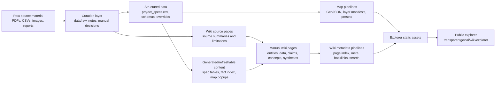

# TransparentGov Knowledge Pipeline

## Context

The Nepal Energy Wiki turns scattered energy-sector evidence into a navigable public research system. Inputs include PDFs, annual reports, project registries, structured CSVs, map sources, and hand-reviewed notes. Outputs include wiki pages, GeoJSON layers, search indexes, fact indexes, backlinks, claim-governance metadata, and data-quality reports.

## Constraints

- Public source material is inconsistent and often incomplete.
- Some project coordinates and transmission alignments are approximate.
- Many source PDFs are useful but not cleanly machine-readable.
- The public site should remain static and easy to deploy.
- Human-readable research pages must stay compatible with machine validation.
- Agents and humans both edit the repo, so drift controls must be explicit.

## Architecture



Core commands:

```bash
make wiki-index
python scripts/build_tributary_maps.py
python scripts/report_spec_completeness.py --all
make validate
make test
```

## Tradeoffs

- Static JSON and GeoJSON are simpler than a database, but every change must be rebuilt deliberately.
- CSV-backed project specs are reviewable, but require schema and completeness checks.
- Markdown pages support Git review, but need frontmatter and template discipline.
- Map layers are useful for public reasoning, but route confidence must be surfaced honestly.

## Failure Modes

- A page claims a number without a source link.
- A generated cache goes stale after page edits.
- A project slug exists in structured data but not in the wiki.
- A source `Used By` list drifts from exact backlinks.
- A map trace gets read as engineering-grade alignment.
- Search quality regresses after content changes.

## Mitigations

- `scripts/validate_repo.py` checks wiki structure, generated caches, map manifests, and hygiene.
- `make test` runs source Used By integrity and strict search benchmarks.
- `wiki/TEMPLATES.md` defines required sections by page type.
- `wiki/GOVERNANCE.md` defines authority levels and hierarchy rules.
- `wiki/QUALITY_RUBRIC.md` prevents overbuilding or underbuilding pages relative to tier.
- Data pages and entity pages include caveats and confidence notes where public evidence is weak.

## Next Improvements

- Convert the solar LOI slug warning into either record-tier wiki pages or an explicit accepted map-only state.
- Add per-layer provenance pages for every major GeoJSON output.
- Add a command that rebuilds all generated explorer assets and reports the exact changed files.
- Add more machine checks for forbidden page-type behaviors, especially policy language in lower-level pages.

## See also

- [Case study: Nepal Energy Wiki](../case-studies/transparentgov-nepal-energy-wiki.md) — narrative overview and governance model.
- [Agent Workflow](transparentgov-agent-workflow.md) — how editing agents interact with this pipeline.
- [Production Architecture](transparentgov-production-architecture.md) — how generated outputs become the deployed site.

