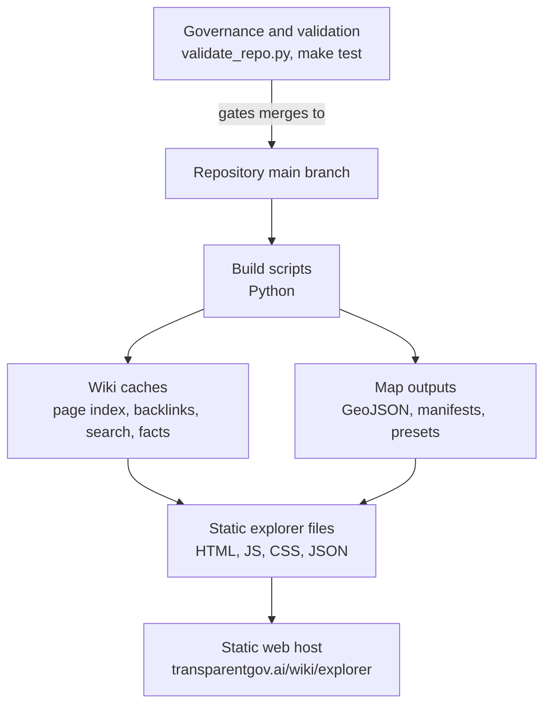

# TransparentGov Production Architecture

> A TransparentGov platform pattern, illustrated by the Nepal Energy Wiki — the first content vertical.

## Context

The public site is a static wiki and map explorer. The production goal is not high-concurrency transactional application behavior. It is reproducible publication of a research artifact: pages, JSON indexes, GeoJSON layers, images, and map configuration should build locally and deploy predictably from `main`.

## Constraints

- Hosting should stay simple and low-maintenance.
- The explorer must work without a backend service.
- Search and page navigation need to be fast enough in the browser.
- Map layers must be inspectable as files.
- Generated files should be deterministic enough to review in Git.
- The system must tolerate incomplete data and source disagreements.

## Architecture

The deployable surface is primarily:

- `wiki/`
- `wiki/explorer/`
- `wiki/explorer/shared/`
- `data/processed/maps/`

The development surface includes:

- `scripts/`
- `data/raw/`
- `data/processed/tables/`
- `docs/`
- `notes/`

## Tradeoffs

- Static hosting removes backend operational complexity, but pushes dynamic behavior into generated client-side indexes.
- Client-side search is easy to deploy, but needs benchmark tests to prevent ranking regressions.
- GeoJSON files are transparent and portable, but large or numerous layers can affect browser performance.
- Deployment from `main` is simple, but raises the importance of pre-push validation.

## Failure Modes

- Generated search or page metadata becomes stale.
- A layer manifest points to a missing or malformed GeoJSON file.
- A map layer renders but miscommunicates confidence.
- A page exists in the wiki but is not indexed correctly.
- A pipeline change updates generated assets in a noisy or non-reviewable way.
- Browser performance degrades as layers and page indexes grow.

## Mitigations

- `make wiki-index` rebuilds page indexes, backlinks, facts, claim governance, search, and vector search assets.
- `scripts/validate_repo.py` checks caches, map manifests, page structure, and tracked hygiene.
- `make test` runs explorer/search-related tests and strict benchmark evaluation.
- Layer manifests and presets keep map configuration declarative.
- Page frontmatter classifies generator behavior: `auto-stub`, `specs-refresh`, or `manual`.
- Known confidence limits are documented in data/entity pages rather than hidden in code.

## Next Improvements

- Add a one-command production build target that rebuilds wiki indexes, map layers, validation, and tests.
- Add screenshot regression checks for key explorer presets.
- Add a generated deployment manifest listing page count, layer count, search benchmark result, and validation status.
- Add per-layer size/performance budget checks.
- Add a public changelog generated from `wiki/WIKI_AUDIT_LOG.md` or curated release notes.

## See also

- [Case study: Nepal Energy Wiki](../case-studies/transparentgov-nepal-energy-wiki.md) — what the deployed site is for.
- [Knowledge Pipeline](transparentgov-knowledge-pipeline.md) — how the deployed assets are produced.
- [Agent Workflow](transparentgov-agent-workflow.md) — pre-push validation and audit discipline.

