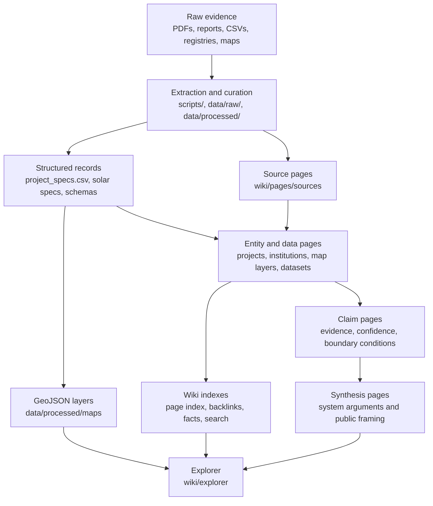
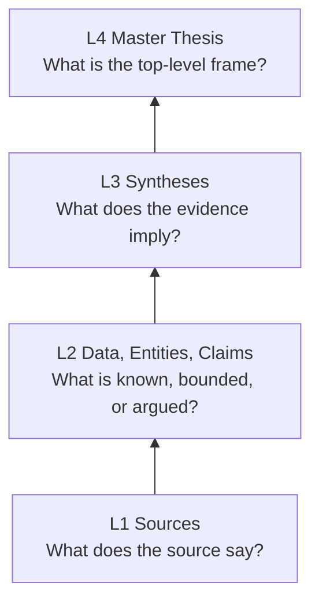

# TransparentGov AI Nepal Energy Wiki: Public Energy Knowledge Infrastructure

## Summary

The Nepal Energy Wiki is a public research system for Nepal's electricity sector. It combines a structured wiki, a Leaflet map explorer, hand-curated project databases, search indexes, and Python build pipelines to make energy claims traceable back to sources, datasets, and map layers.

The core problem is not that Nepal lacks energy information. It is that information is scattered across annual reports, PDFs, project registries, transmission documents, news items, and institutional claims. Numbers get repeated without context. Project capacities are treated as equivalent to deliverable value. Transmission, seasonality, storage, trade, and project finance are discussed in separate silos.

This project turns that fragmented evidence base into a governed knowledge system.

## Problem

Nepal's electricity-sector debate has a source-discipline problem:

- project facts are spread across NEA reports, DoED-linked registries, lender documents, planning studies, and ad hoc project disclosures;
- the same capacity or project-status claim can appear with different values in different sources;
- quantitative claims often travel without source context, confidence boundaries, or caveats;
- maps can make survey-stage projects look equivalent to operating assets;
- strategic conclusions often get mixed into data notes, source summaries, and project records.

The result is a research environment where confident narratives are easy to produce and hard to audit.

## What I Built

I built a public knowledge infrastructure stack with four connected surfaces:

| Surface | Purpose |
|---|---|
| Wiki | 380 interlinked markdown pages across sources, data, entities, claims, concepts, syntheses, and interventions |
| Map explorer | Static Leaflet app combining wiki reading with hydropower, transmission, storage, basin, solar, and geopolitics layers |
| Project databases | Structured CSV-backed hydropower and solar project records with schema and completeness checks |
| Build pipelines | Python scripts for GeoJSON generation, wiki indexes, backlinks, search, fact extraction, validation, and data-quality reporting |

The system is designed so a reader can move from a public-facing claim to the pages, data layers, source summaries, and map context that support or limit it.

## Architecture

## Governance Model

The wiki uses a hierarchy that prevents evidence and interpretation from collapsing into one undifferentiated note layer.

The rule is simple: interpretation can move upward, but not downward.

- Source pages describe evidence and limitations, not strategy.
- Data pages describe datasets, coverage, methods, and caveats, not policy implications.
- Entity pages describe projects, institutions, and actors, not prescriptions.
- Claim pages hold bounded arguments with confidence and boundary conditions.
- Synthesis and intervention pages are where the "so what" belongs.

This is enforced through:

- `wiki/GOVERNANCE.md` for authority hierarchy and invariants;
- `wiki/ONTOLOGY.md` for canonical terms and aliases;
- `wiki/TEMPLATES.md` for required page sections;
- `wiki/QUALITY_RUBRIC.md` for page-quality tiers;
- `wiki/FLAGGED_FOR_REVIEW.md` for unresolved editorial or evidence issues;
- `wiki/WIKI_AUDIT_LOG.md` for session-level accountability.

## Agent Workflow

The project uses AI coding agents as editors and maintainers, but the repo is designed to limit common agent failure modes:

| Failure mode | Control |
|---|---|
| Context drift | bounded batches, explicit handoff prompts, audit log entries |
| Inconsistent terminology | ontology file, canonical page slugs, template discipline |
| Unsourced quantitative claims | validation and governance invariants |
| Inflated backlinks | exact backlink checks for source `Used By` sections |
| Search regressions | strict search benchmark in `make test` |
| Hierarchy violations | page-type rules and targeted scans for prescriptive or proof-language patterns |

The important lesson is that agents become more reliable when the repository contains governance infrastructure, not just prose instructions.

## Representative Pipeline Scripts

| Script | Role |
|---|---|
| `scripts/normalize_frontmatter.py` | normalizes page metadata so wiki pages can be parsed consistently |
| `scripts/gen_wiki_stubs.py` | generates or refreshes project spec tables while preserving hand-written prose |
| `scripts/build_tributary_maps.py` | builds GeoJSON display layers and map-facing project data |
| `scripts/build_wiki_page_index.py` | builds the wiki page index used by the explorer |
| `scripts/build_backlinks.py` | builds page backlink metadata |
| `scripts/build_wiki_search_index.py` | builds the client-side search index |
| `scripts/build_wiki_fact_index.py` | builds structured facts for explorer search and display |
| `scripts/build_claim_governance.py` | exports claim-governance metadata for validation and review |
| `scripts/check_source_used_by.py` | verifies source `Used By` sections against exact backlinks |
| `scripts/report_spec_completeness.py` | scores hydropower project-spec completeness |
| `scripts/report_solar_spec_completeness.py` | scores solar project-spec completeness |
| `scripts/validate_repo.py` | validates wiki structure, generated caches, manifests, and hygiene |

## Engineering Decisions

**Static deployment over application server.** The explorer is static HTML, JS, JSON, and GeoJSON. This keeps deployment simple and makes the public site cheap to host, but shifts complexity into build scripts and generated assets.

**Markdown plus structured frontmatter.** Wiki pages stay readable in Git, while frontmatter gives scripts enough structure to validate, index, and classify pages.

**Hand-curated structured data.** The project does not pretend source extraction is fully automated. Critical energy-sector facts are curated into CSVs and wiki pages, then checked by scripts.

**Approximate map geometry with explicit confidence.** Many public sources do not provide tower-grade alignments. The map distinguishes analytical corridor traces from surveyed engineering routes.

**Governance as code-adjacent infrastructure.** The wiki has governance documents, validators, tests, and audit logs because the hardest part is preserving source discipline over many editing sessions.

## Tradeoffs

- A static explorer is robust and portable, but lacks database-backed live querying.
- Markdown pages are transparent and easy to review, but require disciplined templates.
- Hand-curation improves quality but does not scale like bulk scraping.
- Approximate geospatial layers are useful for system reasoning but must not be presented as engineering-grade coordinates.
- Agent-assisted editing increases throughput but requires validation, audit logging, and bounded scopes.

## Next Improvements

The highest-leverage next moves are:

1. Resolve the remaining solar registry warning by deciding whether the 67 LOI records should become record-tier pages or remain map/data-only.
2. Make validator output quieter so every warning indicates a real action item.
3. Add richer pipeline documentation for solar specs, project specs, and map layer provenance.
4. Add public "evidence trail" views in the explorer so users can move from a claim to its source path more visibly.
5. Expand automated checks for hierarchy violations beyond sources and data pages.
6. Improve screenshot-based UI regression testing for the explorer.

## Further reading

- [Knowledge Pipeline](../architecture/transparentgov-knowledge-pipeline.md) — input-to-output view of the build system.
- [Agent Workflow](../architecture/transparentgov-agent-workflow.md) — how AI editing agents are constrained against the governance model above.
- [Production Architecture](../architecture/transparentgov-production-architecture.md) — static deployment, generated assets, and pre-push gates.
- [Repository README](../../README.md) and [AGENTS.md](../../AGENTS.md) for the contributor view.

