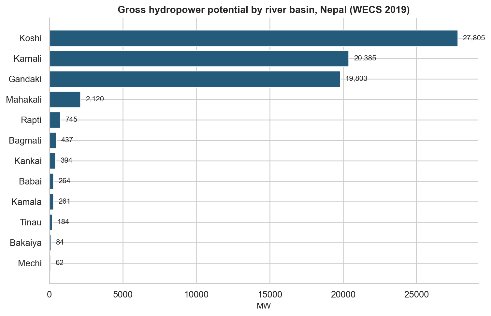
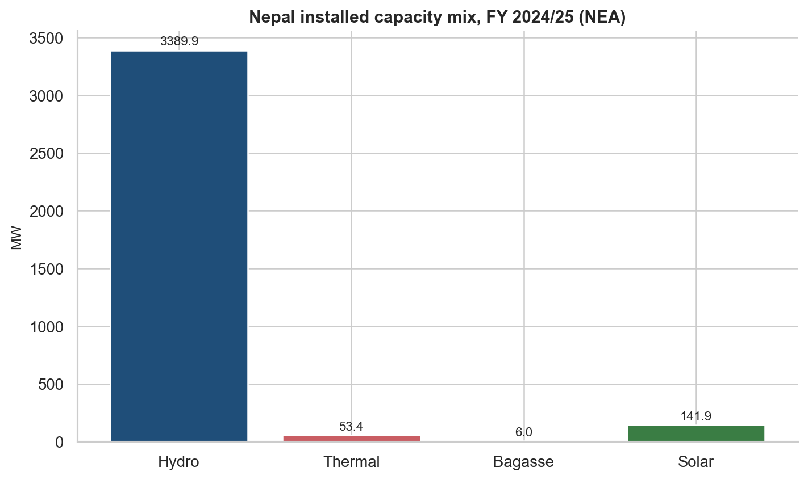
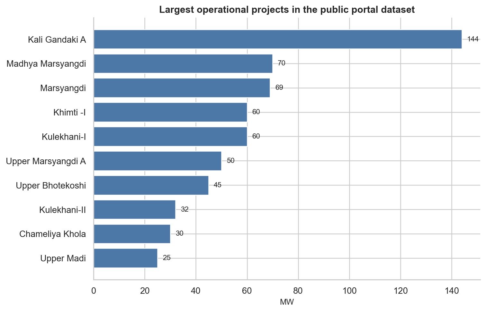
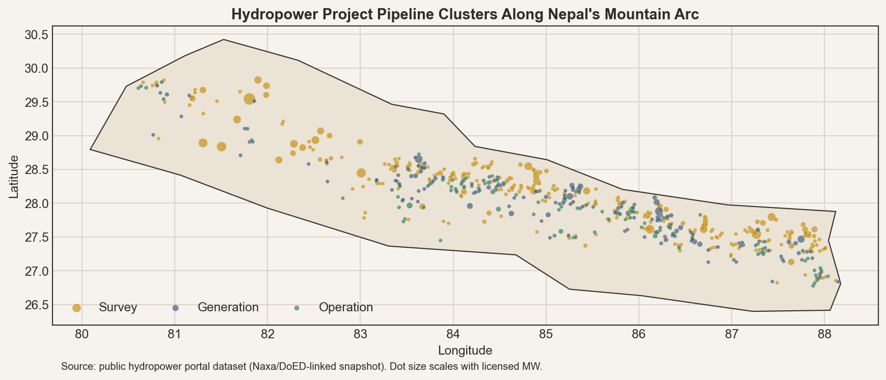
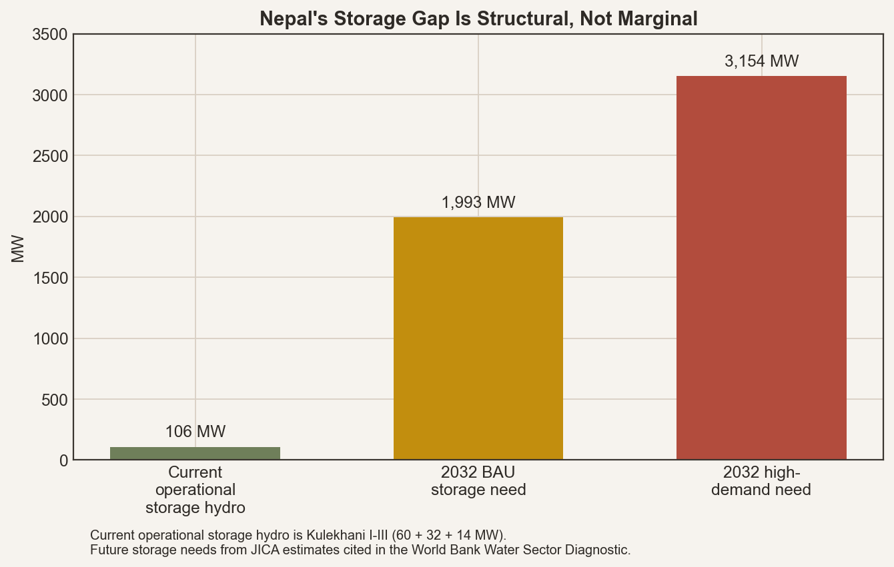
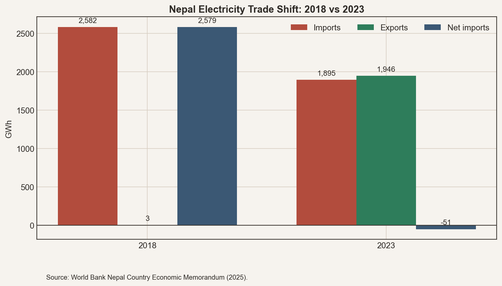

# Nepal's Energy Future Is A Timing Problem

*Working report for deeper research and later video-essay development.*

## Executive Summary

Nepal is often described as a country with "huge hydropower potential." That is true, but it is also incomplete to the point of distortion. Nepal's real energy problem is not the absence of water, rivers, or elevation. It is the inability to convert a highly seasonal mountain hydrology into year-round, dependable, economically valuable electricity.

Three facts define the situation.

First, the resource base is enormous. The big three Himalayan basins alone account for roughly 94% of the country's gross hydropower potential in the latest WECS assessment, with gross potential estimated at 72,544 MW and techno-economic potential at 32,680 MW. [S2]

Second, the system has grown quickly. By FY 2024/25, NEA reports 3,591.262 MW of total installed generation capacity, of which 3,389.912 MW is hydropower. Nepal is no longer trapped in the old story of total shortage and daily load shedding. [S3]

Third, the system is still structurally fragile. More than 90% of hydropower capacity is run-of-river or peaking run-of-river, which means Nepal generates a wet-season surplus and a dry-season deficit. The country became a net electricity exporter in 2023, yet still imports power in the dry season and still faces reliability constraints from weak transmission, limited storage, and incomplete market access. [S4][S5]

That is the core thesis of this report:

**Nepal is not energy-poor. It is dispatch-poor.**

## 1. The Country Has Water, Head, And Scale

Nepal's energy geography is unusually strong. The country sits on four major Himalayan river systems: Mahakali, Karnali, Gandaki/Narayani, and Koshi. Three of those basins dominate the strategic picture. The 2024 River Basin Plans report average annual discharge at the Nepal-India border of about 1,827 m3/s for Koshi, 1,952 m3/s for Gandaki, and 1,256 m3/s for Karnali. In all three, roughly three-quarters of annual runoff arrives in the monsoon season. [S1]

This is why the old slogan about Nepal being rich in hydropower is not wrong. But the shape of that abundance matters more than the total amount. Nepal has water, but it arrives unevenly. Nepal has head, but it sits in remote valleys. Nepal has gross potential, but much of it is difficult, seasonal, or expensive to turn into firm power.

The WECS 2019 assessment makes the concentration of opportunity clear.

Koshi alone accounts for 27,805 MW of gross potential in the WECS screening. Karnali accounts for 20,385 MW and Gandaki for 19,803 MW. Everything else is marginal in comparison. That means Nepal's real energy future lives or dies on what it does with a few giant basins, not on a scattered story of small rivers everywhere. [S2]

The basin logic also reveals why the country is so hard to plan. The largest opportunities are also the ones most exposed to landslides, sediment, flood pulses, remote access, protected-area conflicts, and transmission distance.

## 2. Nepal Built Capacity Faster Than It Built Control

Nepal's hydropower story in the last decade is real progress. By the World Bank's count, hydropower capacity reached about 2,990 MW by the end of 2024. By FY 2024/25, NEA's annual report puts hydro capacity at 3,389.912 MW and total installed generation capacity at 3,591.262 MW. The date gap matters: the two numbers are not contradictory so much as sequential. [S3][S4]

The current capacity mix is still overwhelmingly hydro-dominant.

In FY 2024/25, 22 new projects with 434 MW of combined capacity were commissioned, according to NEA. Private producers have driven most of the recent expansion, and by 2024 the World Bank estimates IPPs accounted for 64% of installed hydropower capacity. [S3][S4]

But Nepal built megawatts faster than it built regulation. Most of the system is run-of-river or peaking run-of-river. That project mix solved the immediate capacity-addition problem because it was quicker, cheaper, easier to finance, and more compatible with private IPP development. It did not solve the national timing problem.

The operating fleet reflects that bias.

The public project portal is not a perfect operating ledger, but it is still useful for seeing which river corridors accumulated buildout first: Kali Gandaki, Marsyangdi, Bhotekoshi, Kulekhani, and the older mid-hill and central-corridor rivers. The map of the broader project pipeline makes the pattern even clearer. [S11]

Projects cluster tightly along Nepal's mountain arc. This is not random. It reflects where steep head, road access, prior studies, transmission prospects, and sponsor confidence aligned. In other words, Nepal's buildout was driven not only by resource quality, but by buildability.

## 3. The Storage Gap Sits At The Center Of The Whole Story

If one idea should organize the rest of the research, it is this:

**Nepal's biggest energy problem is not gross hydropower potential. It is lack of storage.**

The current operational storage base is tiny. Kulekhani remains the key outlier. Kulekhani I is still described by NEA as Nepal's reservoir-type hydropower station, with Kulekhani II and III extending that storage cascade. Together they add up to 106 MW of operational storage hydro and generated 279.8 GWh in FY 2024/25. [S3]

That is negligible relative to the scale of Nepal's river system and to the seasonal volatility it faces.

The World Bank water diagnostic is blunt about the gap. It says Nepal's storage volume requirement to satisfy annual seasonal water demand is 29.86 cubic kilometers and cites JICA estimates that Nepal will need at least 1,993 MW of storage hydropower by 2032 in a business-as-usual case, or 3,154 MW in a high-demand case. [S5]

This is why the absence of large storage is not a secondary issue. It is the reason Nepal can have more hydropower every year and still struggle to provide dry-season firmness.

WECS says the problem directly: because Nepal relies so heavily on ROR and PROR, dry-season hydropower production falls to around one-third of installed capacity. That line should be treated as one of the most important sentences in the whole Nepal energy debate. [S2]

The relevant future projects are therefore not just large because they add megawatts. They matter because they add control:

- Dudhkoshi Storage Hydroelectric Project, 670 MW, with a large reservoir and a 3,377 GWh annual estimate [S3]
- Tanahu Hydropower Project, 140 MW, a storage-type project already under construction [S3]
- Budhi Gandaki, 1,200 MW, system-shaping if ever realized [S1][S4]
- Pancheshwar on the Mahakali, 4,800-5,040 MW depending on source framing, also fundamentally a water-regulation and geopolitics project, not just a power station [S1][S6]

If Nepal wants firm power, flood moderation, irrigation support, and more credible export capacity, it has to stop treating storage as optional.

## 4. Nepal Has Moved From Shortage To Seasonal Surplus

One of the most important changes in the last few years is that Nepal is no longer accurately described as a simple electricity-deficit country. It has become a seasonally surplus hydro system.

The trade data marks the shift.

In 2018, Nepal imported about 2,582 GWh of electricity and exported almost none. In 2023, it imported about 1,895 GWh and exported about 1,946 GWh, becoming a net exporter for the first time. [S4]

That sounds like a structural breakthrough, and it is. But it is not the same thing as year-round balance. The same World Bank memo that records this milestone also explains its limit: because the fleet is dominated by run-of-river plants, Nepal still generates most strongly in the rainy season and still faces deficits in the winter and dry season. [S4]

NEA's FY 2024/25 annual report shows the improved but unfinished system even more clearly. Out of 15,641 GWh of available energy:

- 34% came from NEA and its subsidiaries
- 55% came from IPPs
- 11% was still imported from India [S3]

So the system has improved enough to export seasonally, but not enough to eliminate seasonal dependence on imports.

The more subtle problem is reliability. Scheduled load shedding ended in 2018, yet 76% of firms still reported regular power outages in 2022, and more than 13% reported sales losses above 10% because of power cuts. System losses were still around 12.7% in 2024. [S4]

That means Nepal has improved energy availability much faster than it has improved power quality.

## 5. Transmission And Market Design Are Now As Important As Generation

Once a country crosses from chronic shortage into seasonal surplus, the bottleneck changes. Nepal is now in that transition.

The transmission system has expanded to 5,742 circuit-km of 66 kV and above lines and 8,867 MVA of substation capacity, but the grid still cannot fully move or monetize what the river system can generate. [S10]

Three constraints matter most:

1. Remote hydropower cannot always be evacuated efficiently to major load centers.
2. East-west transfer and balancing depth remain weaker than the generation buildout requires.
3. Cross-border transfer capacity remains limited, around 1,000 MW, which caps export scale even in good wet-season conditions. [S3][S4]

This is why the next megawatt matters less than the next piece of grid depth.

The same logic applies to markets. Nepal can already export power to India. That is no longer hypothetical. But the real commercial challenge is whether exports can become bankable, scalable, and less exposed to bilateral market rules. The current trade structure still depends heavily on Indian regulations, Indian market access, and the strength of cross-border infrastructure. [S4]

In other words, Nepal's energy future is now a system design problem:

- generation alone is not enough
- storage alone is not enough
- transmission alone is not enough

The value appears only when the three work together.

## 6. The Bigger Prize May Be Domestic Industrialization

The export story is real, but it should not become a trap.

Nepal's per-capita electricity consumption is still only around 370-400 kWh, depending on the source year. That is far below the level associated with serious industrial transformation. Meanwhile, the broader final energy system remains dominated by biomass and imported commercial fuels. In the 2022 WECS balance, residential use accounted for 60.75% of total final energy, industry 20.91%, and transport 10.43%, while grid electricity accounted for only 4.96% of final energy. [S4][S10]

That implies a crucial point: Nepal's electricity system has advanced faster than Nepal's total energy transition.

So what should Nepal do with future hydropower?

The highest-value answer is not purely "export more." It is:

- export wet-season surplus where that improves system economics
- deepen domestic industrial demand
- reduce captive diesel generation
- electrify transport and cooking where possible
- use reliable power to support higher-value manufacturing and services

Exports are important because they monetize surplus. Domestic industrial use is important because it can reshape the economy.

That is a much bigger prize.

## 7. Water Is Also Strategy, But Nepal Has Not Fully Converted It Into Leverage

Nepal's rivers matter downstream. The National Water Plan's widely cited estimate is that Nepal-origin rivers contribute about 40% of the Ganges' mean annual flow and about 70% of its dry-season flow. Even if those numbers are older and should not be treated as timeless constants, the strategic meaning remains intact: Nepal matters disproportionately in the wider basin system, especially in the dry season. [S6]

The strongest downstream case is the Koshi, where water volume, flood risk, and sediment load all matter. ICIMOD notes that the basin contributes very large sediment loads into the Ganges system, which means Nepal's water story is not only about electricity. It is also about flood control, embankment stress, river instability, and downstream agriculture. [S7][S8]

But Nepal's leverage has limits. It sits upstream, yet it has relatively little storage and only partial basin-scale regulation. Its treaties with India are mostly project-based rather than expressions of broad hydrological sovereignty. So the country has real negotiating relevance, but not automatic control. [S1][S6]

That is why climate change raises the stakes. Glacier retreat, growing glacial lakes, landslides, sediment pulses, and more variable flows all increase the value of basin coordination, storage, and risk management. If the hydrology becomes less stable, upstream regulation becomes more strategic. [S7][S8][S9]

## 8. What A Rational 20-Year Strategy Would Look Like

If the research is pointing anywhere, it is toward a strategy much more disciplined than "build more hydro."

The core elements would be:

### 1. Move from capacity maximization to firm-power maximization

Nepal has already proved it can add hydro capacity. The next phase should prioritize assets that increase dry-season reliability and dispatchability.

### 2. Build storage deliberately, not symbolically

That means a sequenced program around the most system-useful storage and multipurpose projects, not a vague rhetorical commitment to big dams.

### 3. Treat transmission as part of generation economics

Every major basin plan should be judged together with evacuation corridors, substations, and cross-border options.

### 4. Build domestic demand at the same time

Nepal should not wait for industrial demand to appear on its own. It should use tariffs, infrastructure, and industrial policy to make electricity-intensive growth viable.

### 5. Upgrade the system for climate resilience

That means better hydromet, better sediment monitoring, stronger flood design standards, and explicit planning for landslide and GLOF risk.

### 6. Think in basins, not just in projects

Project-by-project opportunism is the wrong scale for a country whose hydropower future depends on a handful of giant river systems.

## Final Read

The strongest reading of the evidence is not that Nepal lacks energy. It is that Nepal has not yet learned how to hold, move, price, and strategically use the energy it already has.

The national failure is not hydrological scarcity.

It is incomplete conversion.

Water becomes electricity only when it is timed.
Electricity becomes wealth only when it is delivered.
And hydropower becomes strategy only when it is regulated.

## Sources

- [S1] River Basin Plans and Hydropower Development Master Plan (2024): https://giwmscdntwo.gov.np/media/pdf_upload/River%20Basin%20Plan_Final%20Main%20Report_Print%20version_corrected_20240924_vvcb7lm.pdf
- [S2] WECS, Assessment of Hydropower Potential of Nepal (2019): https://wecs.gov.np/content/37/hydropower-potential-of-nepal-2019/
- [S3] Nepal Electricity Authority Annual Report FY 2024/25: https://neasite.dryicesolutions.net/uploads/shares/publication/77022320.pdf
- [S4] World Bank, Nepal Country Economic Memorandum (2025): https://documents1.worldbank.org/curated/en/099032125103030263/pdf/P179761-430153ad-672c-4418-89c5-ef3740c65113.pdf
- [S5] World Bank, Nepal Water Sector Diagnostic: https://documents1.worldbank.org/curated/en/099605103232250863/pdf/P17157506ca2380d5096a90d786e1c2d560.pdf
- [S6] National Water Plan, Nepal: https://lpr.adb.org/sites/default/files/resource/650/nepal-water-plan.pdf
- [S7] ICIMOD, Koshi Basin Programme: https://www.icimod.org/initiative/koshi-basin-programme-future/
- [S8] ICIMOD, Threats to the Koshi River Basin: https://lib.icimod.org/record/33718/files/icimodKoshiSediments.pdf
- [S9] ICIMOD HKH glacier change summary: https://lib.icimod.org/records/z2xka-9nz56
- [S10] WECS Energy Sector Synopsis Report 2024 | FY 2079/80: https://giwmscdntwo.gov.np/media/pdf_upload/Energy%20Sector%20Synopsis%20Report%20%282024%20FY%202079-80%29_qbbivka.pdf
- [S11] Public hydropower portal dataset: https://hydro.naxa.com.np/core/datasets/
